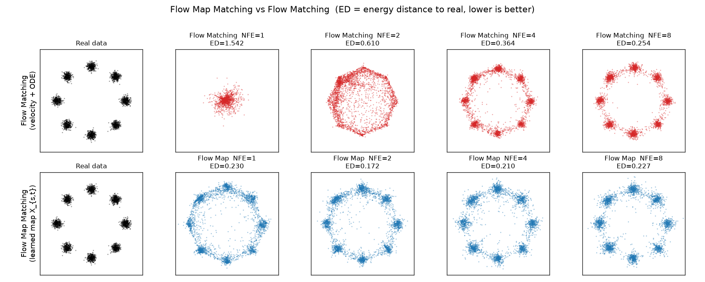
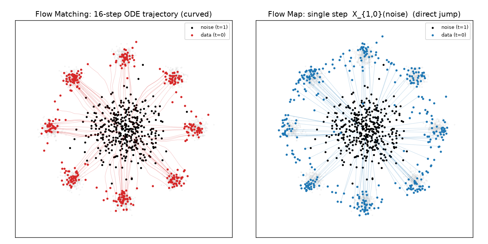

# Flow Map Matching (流映射匹配)

从零实现 **Flow Map Matching**，并与经典 **Flow Matching** 对比，直观展示
"流映射 (flow map)" 如何实现 **1 步 / 少步生成**。

> 论文: **"Flow Map Matching"** — Boffi, Albergo, Vanden-Eijnden (2024),
> arXiv:2406.07507。
>
> 说明: 本实现基于对该论文核心思想的复现（写作时环境无法访问 arXiv，公式表述
> 以对论文方法的理解为准）。核心机制（两时刻流映射、恒等边界参数化、拉格朗日
> 目标、半群少步采样）与论文一致；论文另有 Eulerian / 免蒸馏等变体，见下文。

---

## 一句话核心

| | 学习对象 | 生成 |
|---|---|---|
| **经典 Flow Matching** | 瞬时速度场 `v_t(x)` | 用 ODE 求解器多步积分（NFE 高） |
| **Flow Map Matching** | 两时刻传输映射 `X_{s,t}(x)` | 一步/少步直达（NFE 低） |

流映射 `X_{s,t}` 就是 Flow Matching 那条概率流 ODE 的**解算子**：把 `s` 时刻的
样本一步送到 `t` 时刻。学会了它，就不必再一小步一小步地积分。

---

## 数学要点

**1) 随机插值（前向路径）** — 线性插值，与仓库 `diffusion_advanced/flow_matching.py` 一致：

```
x_t = (1 - t)·x_0 + t·ε,   t ∈ [0,1],  ε ~ N(0, I)     # t=0 数据, t=1 噪声
```

条件速度沿单条路径为常数 `dx_t/dt = ε - x_0`；边缘速度场
`v_t(x) = E[ε - x_0 | x_t = x]`，概率流 ODE 为 `dX/dt = v_t(X)`。

**2) 流映射的定义**（ODE 解算子）：

```
d/dt X_{s,t}(x) = v_t( X_{s,t}(x) ),    X_{s,s}(x) = x
```

两条关键性质：

- 恒等边界：`X_{s,s}(x) = x`
- 半群：`X_{t,u} ∘ X_{s,t} = X_{s,u}`  ← 少步生成的理论依据

生成 = `X_{1,0}(噪声)`。

**3) 参数化**（自动满足恒等边界）：

```
X_{s,t}(x) = x + (t - s)·g_φ(x, s, t)
```

`t → s` 时 `(t-s) → 0`，自动得到 `X_{s,s}=x`。`g_φ` 是"从 s 到 t 的平均速度"；
经典 Flow Matching 的 `v_t(x)` 正是它在 `t→s` 的极限。

**4) 训练目标：Lagrangian Flow Map Matching (LFMM)**

直接利用 `d/dt X_{s,t}(x) = v_t(X_{s,t}(x))`：

```
L_LFMM = E_{s,t,x_s}  ‖ ∂_t X_{s,t}(x_s) - v_t( X_{s,t}(x_s) ) ‖²
```

- `x_s` 取自 `s` 时刻边缘分布（`x_s = (1-s)x_0 + s·ε`）
- `v_t` 为**冻结的已训练速度场**（stop-grad）——因此本实现是**蒸馏**式
- `∂_t X` 用**前向模式自动微分 (JVP)** 精确计算，无需模拟/展开 ODE，
  每步仅一次 JVP，稳定高效（见 `flow_map.py: lagrangian_flow_map_loss`）

**5) 采样（半群少步）**：时间网格 `1=τ_0 > … > τ_k=0`，迭代 `x ← X_{τ_i, τ_{i+1}}(x)`；
`k=1` 即一步生成。

---

## 与 Consistency Model 的关系

Consistency Model 学习"任意时刻 → 固定数据端"的单时刻映射 `X_{t,0}`，是
Flow Map Matching 在**固定一个端点**时的特例。Flow Map Matching 学的是完整的
两时刻映射 `X_{s,t}`，因此**同时一般化了** Flow Matching（`t→s` 极限）与
Consistency Model（固定端点）。

---

## 运行

```bash
cd flow_map_matching

python flow_map.py     # 训练 + 打印相同 NFE 下的能量距离对比表
python compare.py      # 训练 + 对比表 + 生成 comparison.png / trajectory.png
```

- `flow_map.py`：核心实现（插值、速度场、流映射、LFMM 损失、两种采样、能量距离）
- `compare.py`：对比实验与可视化

---

## 实验结果（2D 八高斯环，CPU 可跑）

相同 NFE（网络前向次数）下，与真实分布的**能量距离**（越小越好）：

| NFE | Flow Matching | Flow Map |
|----:|--------------:|---------:|
| 1   | 1.54          | **0.23** |
| 2   | 0.61          | **0.17** |
| 4   | 0.36          | 0.21     |
| 8   | 0.25          | 0.23     |
| 16  | 0.16          | 0.13     |

**结论**：
- **NFE=1**：经典 Flow Matching 因 Euler 步长过粗、样本塌缩到中心（ED≈1.5）；
  Flow Map 一步即恢复出 8 个模态（ED≈0.23）。
- Flow Map 仅需 **1~2 步** 即可媲美 Flow Matching **8~16 步** 的质量。
- 高 NFE 时两者收敛到同一分布——符合预期，因为流映射正是 Flow Matching
  概率流 ODE 的解算子。



上排 Flow Matching / 下排 Flow Map，列为 NFE=1/2/4/8。



左：Flow Matching 的 16 步弯曲 ODE 轨迹；右：Flow Map 的单步"直达跳跃" `X_{1,0}(噪声)`。

---

## 论文中的其它变体（本实现未展开）

- **Eulerian Flow Map Matching (EFMM)**：改用流映射在 `s` 方向满足的输运 PDE
  `∂_s X_{s,t}(x) + ∇_x X_{s,t}(x)·v_s(x) = 0` 作为蒸馏目标（需 Jacobian-向量积）。
- **Distillation-free（免蒸馏）**：不依赖预训练速度场，直接用插值构造无偏目标
  自训练流映射。

本实现选择最清晰的 **LFMM 蒸馏** 形式来突出"流映射 = 摊还的 ODE 求解器"这一核心机制。
